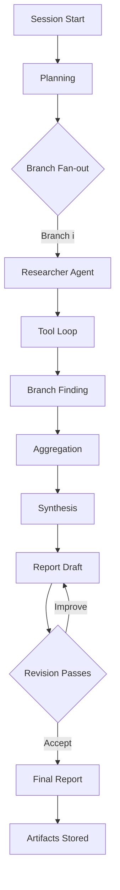

# Marconian Research Flow

The diagram below visualizes how the orchestrator coordinates planning, branching, and synthesis in the current implementation. Each research branch executes concurrently, works through tool interactions, and routes its findings back through the aggregation and reporting pipeline.

* **Planning** – The orchestrator prompts Azure OpenAI to enumerate research branches.
* **Branch Fan-out** – Each plan branch becomes an autonomous `ResearcherAgent` task executed in parallel.
* **Tool Loop** – Researchers iterate through search, scraping, and file/image tools until enough evidence is collected.
* **Aggregation & Synthesis** – Findings flow back to the orchestrator’s aggregator, which produces a synthesized summary.
* **Report Draft & Revision** – The orchestrator emits a Markdown report and optionally cycles through editor passes before persisting the final artifacts.

This static overview complements the live Mermaid diagrams generated during each run (see the runtime implementation for details).
